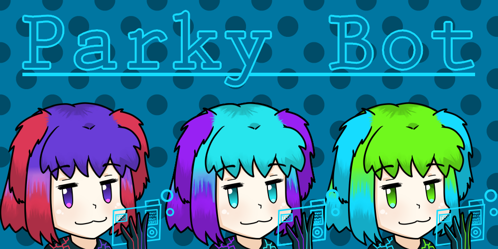

# Parky's (twitch) bot
\
This is my cross-platform twitch bot project where I attempt to write as much code by my own as possible, even tho I should use competent 3rd party libraries instead (IRC, Twitch).

### Features
- Connect to Twitch chat via IRC, parse messages/sender
- Connect to Twitch API via kraken v5, allowing editors to change stream status/game
- Play media with python-vlc
- Google's text to speech

### Adding a command is this easy:
`parky_bot/app.py`
```python
@BOT.decorator('!hello'):
def my_custom_command(message):
    BOT.send_message(f'Howdy {message.sender}!')
 ```

### Dependencies
- VLC (for media playback in general)
- Python 3
- Few python dependencies:
```sh
pip3 install -r requirements.txt
```

### Running
```sh
python3 -m parky_bot.app
```

### Disclaimer
This project is under heavy development and subject to refactoring and code smells.

### Contributors
- Energia (Artist) [Twitter](https://twitter.com/JiXiStigma) [Twitch](https://www.twitch.tv/energiaaurea)
